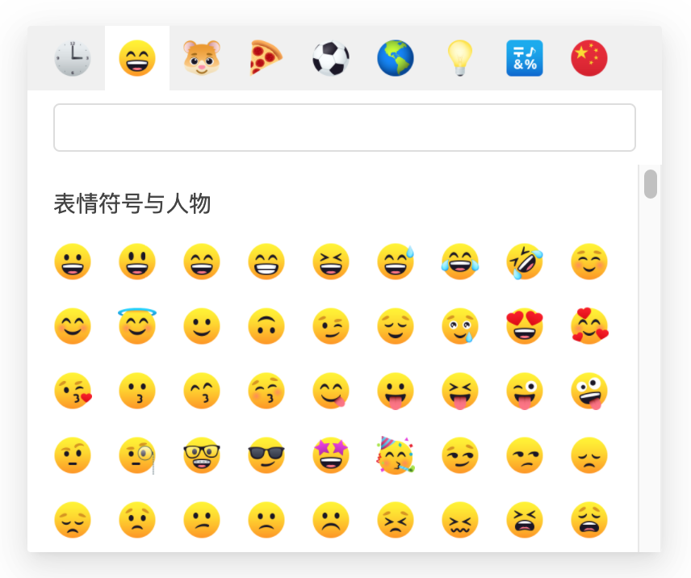

## React Emoji Picker

基于 [emoji-toolkit](https://github.com/joypixels/emoji-toolkit) 实现的 emoji picker

* 演示地址: https://www.einsition.com/demos/yt-emoji-picker
* Emoji cheat sheet 速查表: https://www.einsition.com/tools/emoji-cheat-sheet

### 更新日志

[CHANGELOG.md](CHANGELOG.md)

### 截图




### 安装

```
npm install -S yt-emoji-picker
```


### 使用

```jsx
import React, { useState } from 'react';
import type { EmojiItemProps } from 'yt-emoji-picker/dist/EmojiItem';
import YtEmojiPicker from 'yt-emoji-picker';
import emojiToolkit from 'emoji-toolkit';
import './app.css';
import 'yt-emoji-picker/dist/style.css';
import 'emoji-assets/sprites/joypixels-sprite-32.min.css';

// 全局设置
emojiToolkit.sprites = true; // sprites = true 需要引入 emoji-asset 对应的 css 样式
emojiToolkit.spriteSize = '32';

function App() {
  const [emoji, setEmoji] = useState<EmojiItemProps['emoji']>();

  return (
    <div className="container">
      <YtEmojiPicker
        // sprites = true 需要引入 emoji-asset 对应的 css 样式
        emojiToolkit={{ sprites: true, spriteSize: '32' }}
        onSelect={setEmoji}
        // 启用搜索，搜索规则是 匹配 shortname、shortname_alternates、ascii 和 keywords 字段
        search
      />
      {emoji && (
        <div className="preview" >
          <div>shortname：{emoji.shortname}</div>
          <div>unicode：{emojiToolkit.shortnameToUnicode(emoji.shortname)}</div>
          <div>emoji：<span dangerouslySetInnerHTML={{ __html: emojiToolkit.shortnameToImage(emoji.shortname) }} /></div>
        </div>
      )}
    </div>
  );
}

export default App;
```

### Demo

```
git clone https://github.com/yanthink/react-emoji-picker
cd react-emoji-picker
npm install
npm run build
npm link

cd demo 
npm install
npm link yt-emoji-picker
cd node_modules/react && npm link
cd ../../../ && npm link react
cd demo && npm start
```

### API

| 参数 | 说明 | 类型 | 默认值	 |
| --- | --- | --- | --- |
| categories | 类别设置 | { category: string; title: string; shortname: string; }[] | [defaultCategories](#defaultCategories) |
| emojiToolkit | [emoji-toolkit 选项](https://github.com/joypixels/emoji-toolkit/blob/master/USAGE.md) ，不影响全局设置 | object |  - |
| recentCount | 常用表情个数，0不显示 | number | 36 |
| size | 网格大小 | number | 40 |
| showColCount | 显示列数 | number | 9 |
| showRowCount | 显示列数 | number | 6 |
| search | 启用搜索，搜索规则是匹配 shortname、shortname_alternates、ascii 和 keywords 字段 | boolean | false |
| onSelect | 选择 emoji 表情时触发 | emoji => void | 无 |

### defaultCategories
```ts
const defaultCategories: Categories = [
  {
    category: 'recent',
    title: '常用',
    shortname: ':clock3:',
  },
  {
    category: 'people',
    title: '表情符号与人物',
    shortname: ':smile:',
  },
  {
    category: 'nature',
    title: '动物与自然',
    shortname: ':hamster:',
  },
  {
    category: 'food',
    title: '食物与饮料',
    shortname: ':pizza:',
  },
  {
    category: 'activity',
    title: '活动',
    shortname: ':soccer:',
  },
  {
    category: 'travel',
    title: '旅行与地点',
    shortname: ':earth_americas:',
  },
  {
    category: 'objects',
    title: '物体',
    shortname: ':bulb:',
  },
  {
    category: 'symbols',
    title: '符号',
    shortname: ':symbols:',
  },
  {
    category: 'flags',
    title: '旗帜',
    shortname: ':flag_cn:',
  },
];
```
